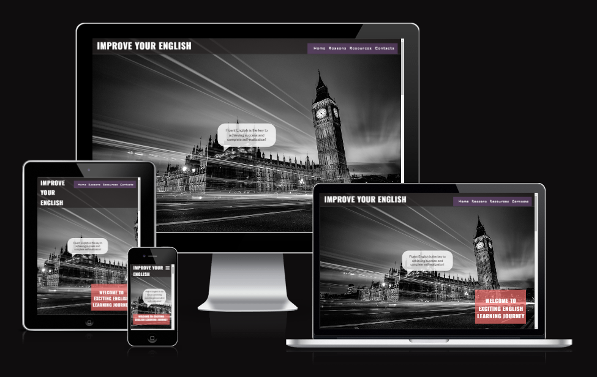

# Project: English Teacher Website

[View the live project here.](https://vladar21.github.io/english-teacher/)

## Description

The "English Teacher" project aims to create a captivating business card website for a self-employed English teacher. The website's main objective is to offer crucial details about the teacher's services, underscore the significance of learning English, and provide a means for potential students to engage with the teacher.

## User Goals

The website is designed for individuals looking to enhance their English language skills. Users should be able to:

- Discover the teacher's qualifications and teaching philosophy.
- Access motivation materials such as text, images, and videos highlighting the advantages of learning English.
- Effortlessly locate contact details for inquiries and enrollment.
- Connect with the teacher via social media platforms and feedback form.

## Features

The English Teacher website will include the following key features:

1. **Home Page:**
   - Short motivational brief and "bubble" speech.
   - Encouragement and motivation for users to embark on their language learning journey.
   - Emphasis on the benefits of achieving English proficiency.

2. **Reasons:**
   - Establish a clear understanding of what potential students can expect from the course.

3. **Learning Resources:**
   - Compilation of text, images, and videos showcasing the practical benefits of English fluency.

4. **Contact Information:**
   - Clear display of contact details.
   - Location information accompanied by a visual map.
   - User-friendly feedback form for sharing feedback, inquiries, and questions.

5. **Social Media Links:**
   - Icons to share the course information on social media.

## Technologies Used

- HTML5: Framework for structuring the website's content.
- CSS3: Tool for styling and designing the layout.

## Installation and Usage

1. Clone this repository: `git clone https://github.com/vladar21/english-teacher.git`
2. Open the `index.html` file in a web browser to navigate the website.

## Future Enhancements

While the current focus is on HTML and CSS, potential future enhancements may encompass:
- Incorporating interactivity and animations using JavaScript.
- Enhancing user engagement through interactive quizzes and exercises.
- Adding a blog section to share valuable language learning insights.

## Credits

### Code

-   Idea of the Speache bubbles CSS & HTML from this [Free Frontend](https://freefrontend.com/css-speech-bubbles/)

-   Idea of the Contact form from this [CodePen Home
Responsive Contact Us Page](https://codepen.io/nguyn-tn-thng/pen/jOqEdZW)

-   The map to the Contacts sections from this [Google Map](https://www.google.com/maps/embed?pb=!1m18!1m12!1m3!1d85668.37611006557!2d35.09295357087713!3d47.856314708191675!2m3!1f0!2f0!3f0!3m2!1i1024!2i768!4f13.1!3m3!1m2!1s0x40dc673dfa85bb03%3A0x7e675cd9074d3f4a!2z0JfQsNC_0L7RgNC-0LbRjNC1LCDQl9Cw0L_QvtGA0L7QttGB0LrQsNGPINC-0LHQu9Cw0YHRgtGMLCDQo9C60YDQsNC40L3QsCwgNjkwMDA!5e0!3m2!1sru!2sie!4v1691538644437!5m2!1sen!2sie)

### Content

-   All content was written by the developer.

### Media

-   Favicon generator from this [Converter](https://favicon.io/favicon-converter/)

-   Image converter for the images of this site [Image converter](https://www.freeconvert.com/)

-   Image to Readme file from this [Am I Responsive?](https://ui.dev/amiresponsive)

-   Images for home, reasons and learn sections from [this](https://jpn.happyvalentinesday2020.online/), [this](https://getwallpapers.com/) and [this](https://pixabay.com/).

-   Image to contacts section from this [Mark Asthoff](https://stocksnap.io/author/6247)

### Acknowledgements
-   Special acknowledgments to my sister Eleonora Bikulova for her invaluable input.

-   Special achnowledgment to My colleugue David Calikes for his incredable site [Cumasc Gael](https://davidcalikes.github.io/portfolio-project-one/), that gave me a lot of design ideas

-   My Mentor for continuous helpful feedback.

-   Tutor support at Code Institute for their support.

## License

This project is licensed under the [MIT License](LICENSE).

---
