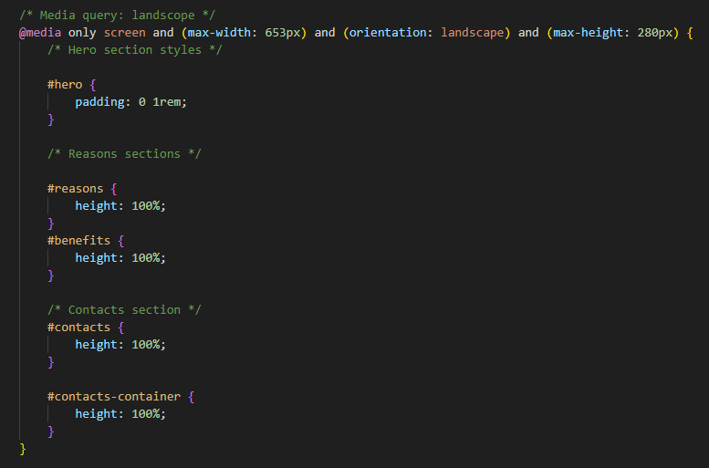

# Project: English Teacher Website

[View the live project here.](https://vladar21.github.io/english-teacher/)

## Description

The "English Teacher" project aims to create a captivating business card website for a self-employed English teacher. The website's main objective is to offer crucial details about the teacher's services, underscore the significance of learning English, and provide a means for potential students to engage with the teacher.

## User Goals

The website is designed for individuals looking to enhance their English language skills. Users should be able to:

- Discover the teacher's qualifications and teaching philosophy.
- Access motivation materials such as text, images, and videos highlighting the advantages of learning English.
- Effortlessly locate contact details for inquiries and enrollment.
- Connect with the teacher via social media platforms and feedback form.

## Features

The English Teacher website will include the following key features:

1. **Home Page:**
   - Short motivational brief and "bubble" speech.
   - Encouragement and motivation for users to embark on their language learning journey.
   - Emphasis on the benefits of achieving English proficiency.

   

2. **Reasons:**
   - Establish a clear understanding of what potential students can expect from the course.

   

3. **Learning Resources:**
   - Compilation of text, images, and videos showcasing the practical benefits of English fluency.

   

4. **Contact Information:**
   - Clear display of contact details.
   - Location information accompanied by a visual map.
   - User-friendly feedback form for sharing feedback, inquiries, and questions.

   

5. **Social Media Links:**
   - Icons to share the course information on social media.

   

## Technologies Used

- HTML5: Framework for structuring the website's content.
- CSS3: Tool for styling and designing the layout.

## Installation and Usage

1. Clone this repository: `git clone https://github.com/vladar21/english-teacher.git`
2. Open the `index.html` file in a web browser to navigate the website.

## Future Enhancements

While the current focus is on HTML and CSS, potential future enhancements may encompass:
- Incorporating interactivity and animations using JavaScript.
- Enhancing user engagement through interactive quizzes and exercises.
- Adding a blog section to share valuable language learning insights.

## Testing

1. The W3C Markup Validator and W3C CSS Validator Services were used to validate every page of the project to ensure there were no syntax errors in the project.

-   [W3C Markup Validator](https://jigsaw.w3.org/css-validator/#validate_by_input) - [Results](https://validator.w3.org/nu/?doc=https%3A%2F%2Fvladar21.github.io%2Fenglish-teacher%2Findex.html)
-   [W3C CSS Validator](https://jigsaw.w3.org/css-validator/#validate_by_input) - [Results](https://jigsaw.w3.org/css-validator/validator?uri=https%3A%2F%2Fvladar21.github.io%2Fenglish-teacher%2Findex.html&profile=css3svg&usermedium=all&warning=1&vextwarning=&lang=en)

2. Accessibility: I confirmed that the colors and fonts chosen are easy to read and accessible by running it through lighthouse in devtools.

3. I tested that this page works in different browsers: Chrome, Firefox, Mircrosoft Edge.

4. I confirmed that this project is responsive, looks good and functions on all standard screen sizes using the devtools device toolbar.

5. I have confirmed that the form works: requires entries in every field, will only accept an email in the email field, and the submit button works.

## Bugs

On some mobile device, when you make landscape view there are two problems:
- In the "hero" section, cover-text div and bubble div bump into each other. I think the couse it in HTML element position (absolute and relative);
- in the "contacts section the bottom of feedback overstretch. I think the cause it in not enough accessibly height in the parent for feedback form.

The solution was to create two special media queries for landscape mode. 
See the image below:

## Deployment

The site was deployed to GitHub pages. The steps to deploy are as follows:
- In the GitHub repository, navigate to the Settings tab.
- From the source section drop-down menu, select the Main Branch.
- Once the main branch has been selected, the page provided the link to the completed website.

The live link can be found here - [English Teacher](https://vladar21.github.io/english-teacher/)

## Credits

### Code

-   Idea of site layout and a lot of styles featers by Code Institute education project from this [Love Running](https://github.com/Code-Institute-Solutions/love-running-v3/tree/main)

-   Idea of the Speache bubbles CSS & HTML from this [Free Frontend](https://freefrontend.com/css-speech-bubbles/)

-   Idea of the Contact form from this [CodePen Home
Responsive Contact Us Page](https://codepen.io/nguyn-tn-thng/pen/jOqEdZW)

-   The map to the Contacts sections from this [Google Map](https://www.google.com/maps/embed?pb=!1m18!1m12!1m3!1d85668.37611006557!2d35.09295357087713!3d47.856314708191675!2m3!1f0!2f0!3f0!3m2!1i1024!2i768!4f13.1!3m3!1m2!1s0x40dc673dfa85bb03%3A0x7e675cd9074d3f4a!2z0JfQsNC_0L7RgNC-0LbRjNC1LCDQl9Cw0L_QvtGA0L7QttGB0LrQsNGPINC-0LHQu9Cw0YHRgtGMLCDQo9C60YDQsNC40L3QsCwgNjkwMDA!5e0!3m2!1sru!2sie!4v1691538644437!5m2!1sen!2sie)

### Content

-   All content was written by the developer.

### Media

-   Favicon generator from this [Converter](https://favicon.io/favicon-converter/)

-   Image converter for the images of this site [Image converter](https://www.freeconvert.com/)

-   Image to Readme file from this [Am I Responsive?](https://ui.dev/amiresponsive)

-   Images for home, reasons and learn sections from [this](https://jpn.happyvalentinesday2020.online/), [this](https://getwallpapers.com/) and [this](https://pixabay.com/).

-   Image to contacts section from this [Mark Asthoff](https://stocksnap.io/author/6247)

-   Create logo image [FreeConvert](https://www.freeconvert.com/)

### Acknowledgements
-   Special acknowledgments to my sister Eleonora Bikulova for her invaluable input.

-   Special thanks to David Calikes for his incredable site [Cumasc Gael](https://davidcalikes.github.io/portfolio-project-one/), that gave me a lot of design ideas

-   My Mentor - Oluwafemi Medale - for continuous helpful feedback.

-   Tutor support at Code Institute for their support.

## License

This project is licensed under the [MIT License](LICENSE).

---
